# Prueba de razonamiento geométrico y manejo de Python

Esta prueba tiene como propósito medir las aptitudes en razonamiento geométrico y manejo de Python de los candidatos a la vacante "Desarrollo de aplicación CAD".
La prueba tiene dos partes a saber: Primero, se presenta una estructura de datos, definida por una clase en Python, para representar una geometría 2-dimensional. Segundo, se plantea un problema a resolver.

Para trabajar en esta prueba se deberá contar con un intérprete de Python y los siguientes módulos instalados:
* Numpy
* Matplotlib

## 1. Representación de una geometría 2-dimensional en Python

Se tiene una geometría 2-dimensional, también llamada ``malla``, hecha de puntos y de líneas. Se define la clase ``Mesh`` para representar dicha geometría con los siguientes atributos:

* ``vertices``: Es un arreglo bidimensional (Numpy.ndarray) de tamaño $n_v$ x 2, donde $n_v$ es el número de vertices o puntos.
* ``elements``: Es una lista anidada de tamaño $n_{el}$, donde $n_{el}$ es el número de líneas ó elementos, así cada objeto en esta lista será un elemento definido por los indices de dos vértices.
* ``elsets``: Es un diccionario que contiene subsets de los elementos. La llave es una cadena de texto y el valor será una lista con los índices de los elementos. A cada una de estas listas se le llama ``elset``.

## 2. Problema

### 2.1 Introducción

Se define una malla ``msh``para representar un círculo con cinco ``elset`` a saber:
* ``msh.elsets['all']``: Lista continua de elementos desde 1 hasta $n_{el}$.
* ``msh.elsets['upper-right']``: Lista con los índices de los elementos que conforman la mitad superior derecha del círculo.
* ``msh.elsets['upper-left']``: Lista con los índices de los elementos que conforman la mitad superior izquierda del círculo.
* ``msh.elsets['bottom-right']``: Lista con los índices de los elementos que conforman la mitad inferior derecha del círculo.
* ``msh.elsets['bottom-left']``: Lista con los índices de los elementos que conforman la mitad inferior izquierda del círculo.

La malla esta ordenada, es decir, la secuencia de los elementos en ``msh.elements`` forma un **lazo cerrado** en tanto que el segundo vértice de un elemento $i$ coincide siempre con el primer vértice de un elemento $i+1$, tal como se ve en la Figura 1.
Las figuras 2-5 muestran los elset definidos para esta malla.

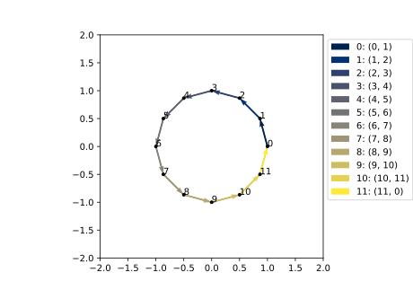

*Figura 1. Malla ordenada: Se presentan los elementos msh.elsets['all'] así como su conectividad.*

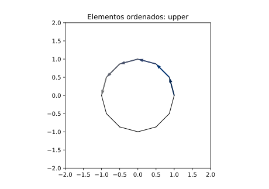

*Figura 2. Malla ordenada: Se presentan los elementos msh.elsets['upper-right'].*

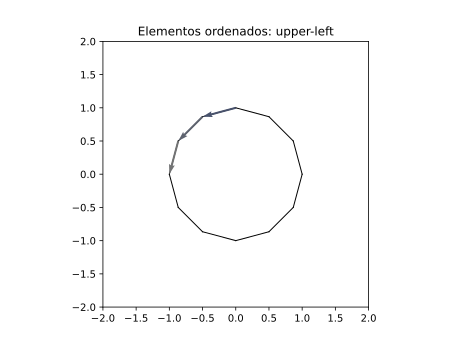

*Figura 3. Malla ordenada: Se presentan los elementos msh.elsets['upper-left'].*

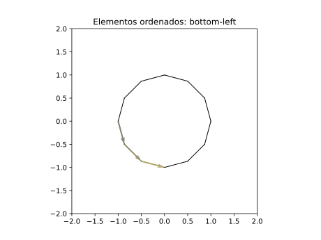

*Figura 4. Malla ordenada: Se presentan los elementos msh.elsets['bottom-right'].*

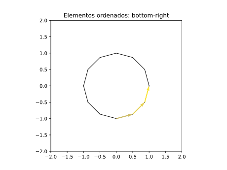

*Figura 5. Malla ordenada: Se presentan los elementos msh.elsets['bottom-left'].*

#### 2.1.1 Desordenar elementos
Se define una función ``shuffle`` en la clase ``Mesh``. Esta función sirve para desordenar los elementos de una malla cambiando el orden de la lista ``elements`` así como el sentido de algunos elementos de forma aleatoria.
Las figuras 6 muestra la conectividad de los elementos desordenados.
Las figuras 7-10 muestran los elset definidos para esta malla.
Es importante notar las siguientes dos cosas que no cambian al invocar la función ``shuffle`` en la malla ``msh``.

1. El listado de elementos en ``msh.elsets['all']``, pues será siempre una lista continua desde 1 hasta $n_{el}$.
2. El orden de los vértices.

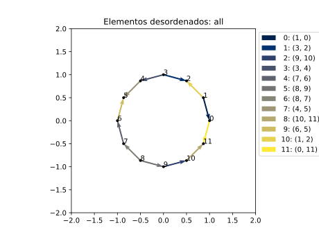

*Figura 6. Malla desordenada: Se presentan los elementos msh.elsets['all'] así como su conectividad.*

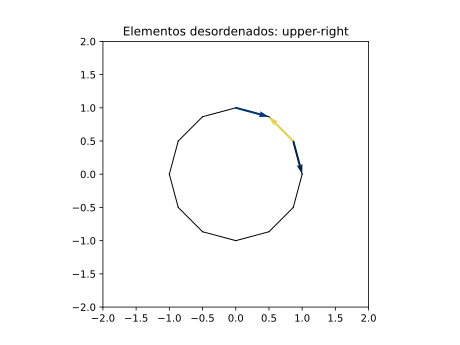

*Figura 7. Malla desordenada: Se presentan los elementos msh.elsets['upper-right'].*

*Figura 8. Malla desordenada: Se presentan los elementos msh.elsets['upper-left'].*

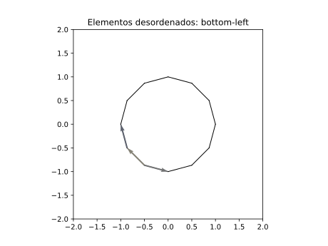

*Figura 9. Malla desordenada: Se presentan los elementos msh.elsets['bottom-right'].*

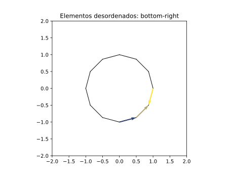

*Figura 10. Malla desordenada: Se presentan los elementos msh.elsets['bottom-left'].*

#### 2.1.2 Dividir la conectividad de los elementos

Se define la función split para dividir la conectividad de la malla. Esta función elimina dos elementos de la malla. 
Se desordenan los elementos de la malla y luego se divide su conectividad.
La malla resultante se presentan en las figuras x-y.

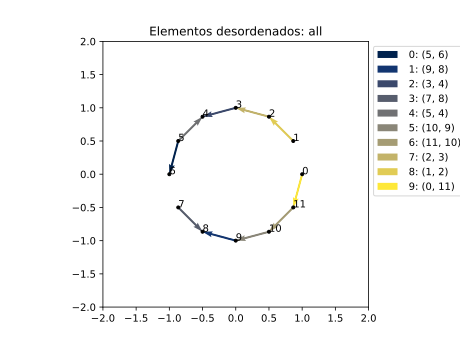

*Figura 11. Malla dividida: Se presentan los elementos msh.elsets['all'] así como su conectividad.*

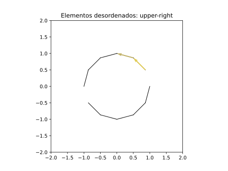

*Figura 12. Malla dividida: Se presentan los elementos msh.elsets['upper-right'].*

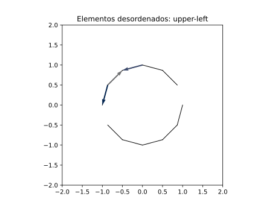

*Figura 13. Malla dividida: Se presentan los elementos msh.elsets['upper-left'].*

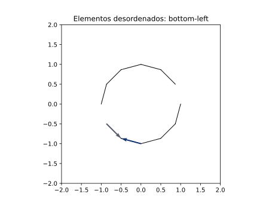

*Figura 14. Malla dividida: Se presentan los elementos msh.elsets['bottom-right'].*

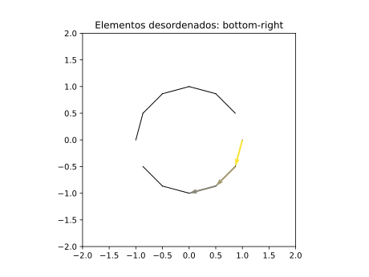

*Figura 15. Malla dividida: Se presentan los elementos msh.elsets['bottom-left'].*

### 2.2 Planteamiento del problema

El fichero [prueba01.py](./prueba01.py) contiene la implementación de la clase ``Mesh`` así como de la función ``draw`` para dibujar mallas. Allí se crea el objeto ``msh`` que es una instancia de la clase ``Mesh`` y representa una cirfuncerencia tal como se explica en la sección 2.1. Se invoca la función ``shuffle`` en este objeto de forma tal que se desordena los elementos.

Se deberá escribir una functión ``sort`` para la clase ``Mesh`` que organice nuevamente los elementos desordenados al invocar la función ``shuffle``. Dicha función deberá cumplir con los siguientes requisitos:

1. La función no tomará ningún argumento y solo podrá usar los miembros de la clase ``Mesh`` definidos en la sección 1. No se podrá usar ninguna información calculada dentro de la función ``shuffle``.
2. La función deberá ordenar la lista ``msh.elements`` de forma tal que los elementos formen un **lazo cerrado** tal como se definió en la sección 2.1. La posición del primer elemento y la orientación del mismo es arbitraria.
3. La función deberá garantizar el mapeo de cada uno de los ``elset`` en ``msh.elsets``, es decir que se deberá poder dibujar nuevamente los elementos superiores e inferiores de la circunferencia. 

### 2.3 Discusión del problema

El candidato deberá enviar la solución al correo electrónico de contacto antes de la discusión.
Durante la discusión el candidato deberá explicar la solución dada al problema y para ello podrá usar cualquier ayuda audiovisual, entre otras: pantallazos, diapositivas y fotos de notas hechas a mano.