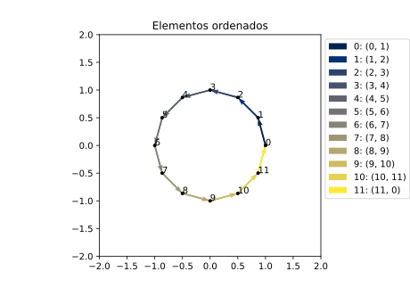
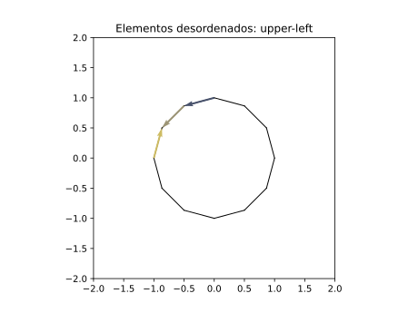

# Prueba de razonamiento geométrico y manejo de Python

Esta prueba tiene como propósito medir las aptitudes en razonamiento geométrico y manejo de Python de los candidatos a la vacante "Desarrollo de aplicación CAD".
La prueba tiene dos partes a saber: Primero, se presenta una estructura de datos, definida por una clase en Python, para representar una geometría 2-dimensional. Segundo, se plantea un problema a resolver.

Para trabajar en esta prueba se deberá contar con un intérprete de Python y los siguientes módulos instalados:
* Numpy
* Matplotlib

## Representación de una geometría 2-dimensional en Python

Se tiene una geometría 2-dimensional, también llamada ``malla``, hecha de puntos y de líneas. Se define la clase ``Mesh`` para representar dicha geometría con los siguientes atributos:

* ``vertices``: Es un arreglo bidimensional (Numpy.ndarray) de tamaño $n_v$ x 2, donde $n_v$ es el número de vertices o puntos.
* ``elements``: Es una lista anidada de tamaño $n_{el}$, donde $n_{el}$ es el número de líneas ó elementos, así cada objeto en esta lista será un elemento definido por los indices de dos vértices.
* ``elsets``: Es un diccionario que contiene subsets de los elementos. La llave es una cadena de texto y el valor será una lista con los índices de los elementos. A cada una de estas listas se le llama ``elset``.

## Problema

### Introducción

Se define una malla ``msh``para representar un círculo con tres ``elset`` a saber:
* ``msh.elsets['all']``: Lista continua de elementos desde 1 hasta $n_{el}$.
* ``msh.elsets['upper']``: Lista con los índices de los elementos que conforman la mitad superior del círculo.
* ``msh.elsets['bottom']``: Lista con los índices de los elementos que conforman la mitad inferior del círculo.

La malla esta ordenada, es decir, la secuencia de los elementos en ``msh.elements`` forma un lazo cerrado en tanto que el segundo vértice de un elemento $i$ coincide siempre con el primer vértice de un elemento $i+1$.

*Figura 1. Malla ordenada: Se presentan los elementos msh.elsets['all'] así como su conectividad.*

*Figura 2. Malla ordenada: Se presentan los elementos msh.elsets['upper'].*

*Figura 3. Malla ordenada: Se presentan los elementos msh.elsets['bottom'].*

Se define así mismo una función ``shuffle`` en la clase ``Mesh``. Esta función sirve para desordenar los elementos de una malla cambiando el orden de la lista ``elements`` así como el sentido de algunos elementos de forma aleatoria. Es importante notar las siguientes dos cosas que no cambian al invocar la función ``shuffle`` en la malla ``msh``.

1. El listado de elementos en ``msh.elsets['all']``, pues será siempre una lista continua desde 1 hasta $n_{el}$.
2. El orden de los vértices.

*Figura 1. Malla desordenada: Se presentan los elementos msh.elsets['all'] así como su conectividad.*

*Figura 2. Malla desordenada: Se presentan los elementos msh.elsets['upper'].*

*Figura 3. Malla desordenada: Se presentan los elementos msh.elsets['bottom'].*

### Planteamiento del problema

El fichero [prueba01.py](./prueba01.py) contiene la implementación de la clase ``Mesh`` así como de la función ``draw`` para dibujar mallas. Se deberá escribir una functión ``sort`` para la clase ``Mesh`` que organice nuevamente los elementos desordenados al invocar la función ``shuffle``.

La función ``sort`` deberá cumplir con los siguientes requisitos:

1. La función deberá ordenar la lista ``msh.elements`` de forma tal que los elementos formen un lazo cerrado. La posición del primer elemento y la orientación del mismo es arbitraria.
2. La función deberá garantizar el mapeo de cada uno de los ``elset`` en ``msh.elsets``, es decir que se deberá poder dibujar nuevamente los elementos superiores e inferiores de la circunferencia.
3. No se podrá usar ninguna información calculada dentro de la función ``shuffle``.